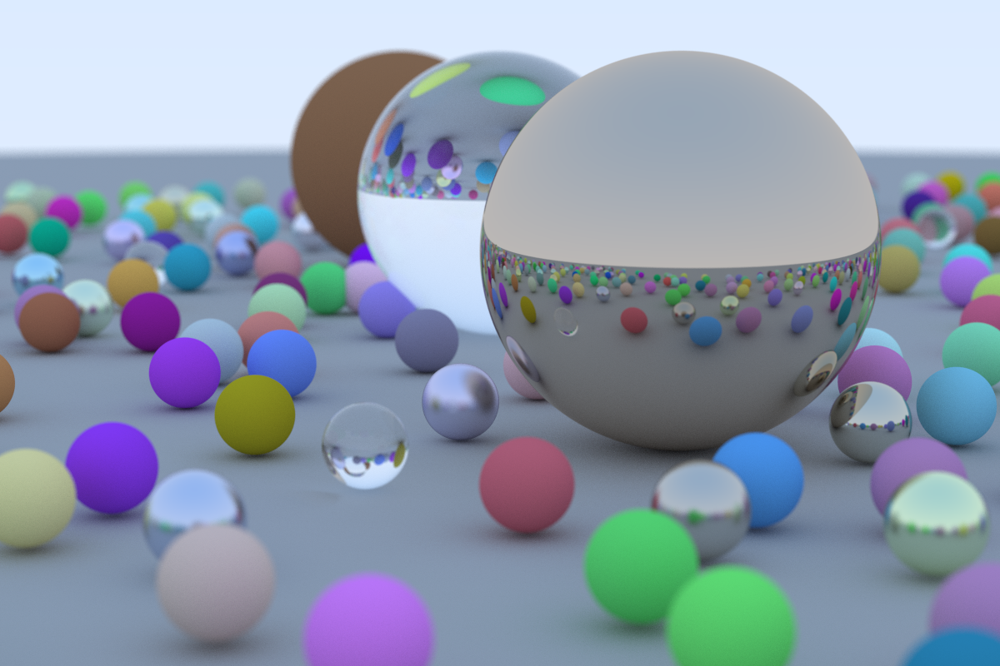

# Rust Ray Tracing

A Rust implementation of the ray tracer which Peter Shirley describes in [_Ray Tracing in One Weekend_](https://raytracing.github.io/books/RayTracingInOneWeekend.html).

## Usage:
If you want to create your own renders using this ray tracer, once you have downloaded or compiled the project binary, usage is as simple as 
```console
./rust_ray_trace <image width> <samples> <maximum depth> <filename>
```
Here `image width` is the desired pixel width of the image (image height will be calculated from this using an aspect ratio of 3:2), `samples` is the number of samples to take per pixel, `max_depth` is the maximum number of bounces to follow a ray over, and `filename` is the desired name of the `.ppm` file to which the image results will be written. Output will be written to the folder from which the binary is called.

A copy of the compiled project binary is provided in this repository for your convenience.

## An Example Render
The below is a 1200 x 800 render produced using this code with a sample rate of 500 and a maximum depth of 50.



## Dependencies
- RNG is provided by the [`rand`](https://crates.io/crates/rand)
- Multithreading is accomplished using [`rayon`](https://crates.io/crates/rayon)

## License
This software distributed under the [MIT License](LICENSE)

